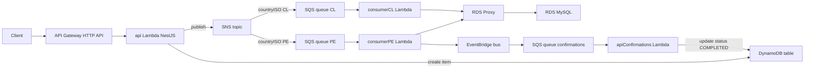

# Appointment API – Despliegue rápido

API de citas (NestJS en AWS Lambda) con orquestación por eventos (SNS, SQS, EventBridge), DynamoDB y RDS MySQL.

## Diagrama simple



## Requisitos para desplegar en AWS

- Cuenta AWS y credenciales con permisos para: CloudFormation, Lambda, API Gateway (HTTP API), DynamoDB, SNS, SQS, EventBridge, RDS, Secrets Manager, EC2/VPC.
- AWS CLI configurado: `aws configure` (Access Key, Secret, región por defecto).
- Node.js 18+ y npm.
- Serverless Framework v3 instalado: `npm i -g serverless` (o usar `npx`).

Variables opcionales (con defaults):

- STAGE: `dev`
- AWS_REGION: `us-east-1`

## Comandos para desplegar (PowerShell)

Instalar dependencias

```powershell
npm install
```

Desplegar toda la infraestructura y funciones

```powershell
npx serverless deploy -s dev -r us-east-1
```

Desplegar solo una función (ejemplos)

```powershell
# API HTTP
npx serverless deploy function -f appointment -s dev -r us-east-1

# Consumidor de confirmaciones
npx serverless deploy function -f appointmentConfirmation -s dev -r us-east-1
```

Ver logs en tiempo real

```powershell
npx serverless logs -f appointment -t -s dev -r us-east-1
```

Eliminar el stack

```powershell
npx serverless remove -s dev -r us-east-1
```

Notas

- Los recursos (tabla DynamoDB, colas, tópico SNS, bus EventBridge, VPC, RDS y Proxy) se crean vía `serverless.yml`.
- No se requieren endpoints locales (toda la configuración apunta a AWS por defecto).

## Pruebas rápidas con curl

> Después de desplegar, puedes probar la API usando los siguientes comandos:

Crear cita

```bash
curl --location 'https://lxh1m7ssc7.execute-api.us-east-1.amazonaws.com/appointments' \
--header 'Content-Type: application/json' \
--data '{
  "insuredId": "00743",
  "scheduleId": 100,
  "countryISO": "PE"
}'
```

Consultar cita

```bash
curl --location 'https://rrn647fdt3.execute-api.us-east-1.amazonaws.com/appointments?insuredId=00743' \
--header 'Content-Type: application/json'
```